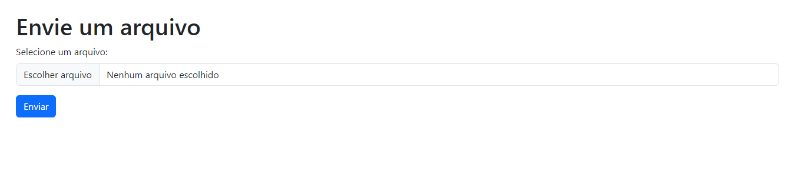

<h1 align="center" style="font-weight: bold;">Tracks REST API 💻</h1>

<div align="center">

![python][PYTHON__BADGE]
![django][DJANGO__BADGE]
![dj-ninja][DJANGO_NINJA__BADGE]
![docker][DOCKER__BADGE]

</div>

<p align="center">
 <a href="#started">Getting Started</a> •
 <a href="#routes">API Endpoints</a> •
 <a href="#author">Author</a> •
</p>

<p align="center">
  <b>Creating a CRUD with django ninja</b>
</p>

<h2 id="started">🚀 Getting started</h2>

To get started, follow the steps below

<h3>Prerequisites</h3>

- [python](https://pyhton.org)
- [poetry](https://https://python-poetry.org/docs/)

<h3>Cloning</h3>

How to clone your project

```bash
git clone https://github.com/duca-meneses/tracks-api.git
```

After cloning the project

```bash
poetry install
```

if you don't use poetry

creating a virtual environment

```bash
python -m venv .venv
```

Activate venv on windows

```bash
.venv/Scripts/activate
```

Active venv on linux/mac

```bash
source .venv/bin/activate
```

Now do the command to install the project dependencies

```bash
pip install -r requirements.txt
```

<h3>Starting</h3>

How to start your project

```bash
cd tracks_api
```

```bash
python manage.py runserver
```

<h2 id="routes">📍 API Endpoints</h2>

Here you can list the main routes of your API, and what are their expected request bodies.

| route                   |     description     |
| ----------------------- | :------------------: |
| GET /api/tracks         |   List all tracks   |
| POST /api/tracks        |    Create a track    |
| PUT /api/tracks/{id}    | Update a track by id |
| DELETE /api/tracks/{id} | Delete a track by id |

<h3 id="get-auth-detail">GET /api/tracks</h3>

**RESPONSE**

```json
[
  {

    "id": "4000",
    "artist": "The Beatles",
    "title": "Yesterday",
    "last_play": "2017-10-18 15:15:26",
    "duration": 200  
  },
  ...
] 
```

<h3 id="post-auth-detail">POST /api/tracks</h3>

**REQUEST**

```json
{
  "id": "4000",
  "artist": "The Beatles",
  "title": "Yesterday",
  "last_play": "2017-10-18 15:15:26",
  "duration": 200 
}
```

**RESPONSE**

```json
{
  "id": "4000",
  "artist": "The Beatles",
  "title": "Yesterday",
  "last_play": "2017-10-18 15:15:26",
  "duration": 200 
}
```

<h3 id="post-auth-detail">PUT /api/tracks/{id}</h3>

**REQUEST**

```json
{
  "id": "4000",
  "artist": "The Beatles",
  "title": "Yesterday",
  "last_play": "2017-10-18 15:15:26",
  "duration": 300 
}
```

**RESPONSE**

```json
{

  "id": "4000",
  "artist": "The Beatles",
  "title": "Yesterday",
  "last_play": "2017-10-18 15:15:26",
  "duration": 300 
}
```

<h3 id="post-auth-detail">DELETE /api/tracks/{id}</h3>

**RESPONSE**

```json
{ 
  "message" : "Track deleted successfully" 
}

```
<h3>Swagger</h3>
you can access this url to access swagger: /api/docs


<h3 id="">Upload File</h3>
<p>In addition to the API, you can also access the path /index to access an HTML form to use the upload file functionality</p>



<h2 id="author">Author</h2>

<table
  >
  <tr>
    <td align="center">
      <a href="#">
        <br>
        <sub>
          <b>Carlos Eduardo</b>
        </sub>
      </a>
    </td>
  </tr>
</table>

<h3>Documentations that might help</h3>

[📝 How to create CRUD with django ninja ](https://django-ninja.dev/tutorial/other/video/)

[PYTHON__BADGE]: https://img.shields.io/badge/python-3670A0?style=for-the-badge&logo=python&logoColor=ffdd54
[DJANGO__BADGE]: https://img.shields.io/badge/django-%23092E20.svg?style=for-the-badge&logo=django&logoColor=white
[DJANGO_NINJA__BADGE]: https://img.shields.io/badge/ninja-1?style=for-the-badge&logo=django&logoColor=%234cae4f&labelColor=black&color=%234cae4f
[DOCKER__BADGE]: https://img.shields.io/badge/docker-1?style=for-the-badge&logo=docker&labelColor=white&color=blue
